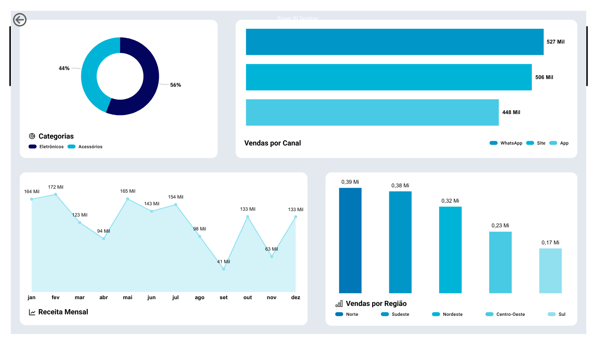
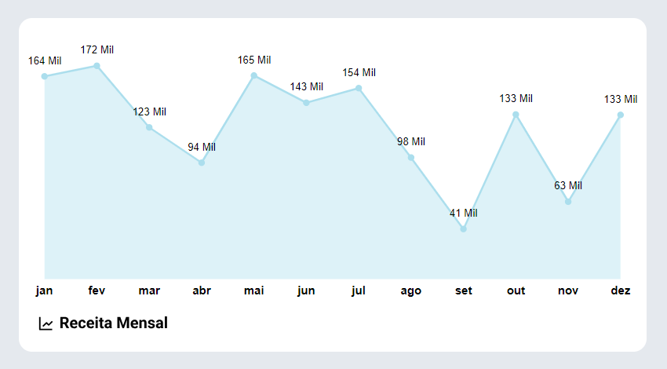
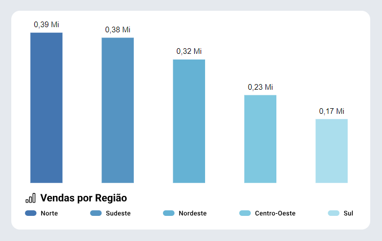

# 📊 Dashboard de Vendas - Power BI

Este projeto apresenta um dashboard interativo desenvolvido no **Power BI**, com o objetivo de analisar as **vendas mensais**, **categorias de produtos**, **canais de venda** e **regiões brasileiras**.

> 💡 Os dados utilizados são **fictícios** e foram gerados para fins educacionais.

---

## 🔎 Visão Geral

[Acesse](https://app.powerbi.com/groups/me/reports/e8ba250d-c074-4df7-a2cf-4419f65537a6/6d1dc1bd897e32c48c0b?experience=power-bi) 

O dashboard responde a perguntas como:
- Qual foi a **receita total por mês**?
- Quais **canais de venda** são mais lucrativos?
- Quais **categorias de produtos** se destacam?
- Qual é o desempenho de vendas **por região**?

---

## 🛠️ Tecnologias Utilizadas

- [Power BI Desktop](https://powerbi.microsoft.com/)
- Excel (para modelagem de dados)
- Python (para geração de dados fictícios - opcional)
- Git e GitHub

---

## 📁 Estrutura dos Dados

A base principal `dados_vendas.xlsx` contém:
- `Data_Venda`
- `Produto`
- `Categoria`
- `Região`
- `Preço Unitário`
- `Quantidade`
- `Canal`

Relacionamento feito com a tabela auxiliar `dados_regioes`:
- `UF`, `Estado`, `Região`

---

## 📌 Principais Métricas Criadas (KPIs)

- Receita Total
- Quantidade Total
- Ticket Médio
- Valor Total
- Vendas por Região
- Vendas Mensais

---

## 📈 Principais Visualizações

- Gráfico de área: Receita por mês
- Gráfico de rosca: Receita por categoria
- Gráfico de barras empilhadas: Receita por canal
- Gráfico de colunas clusterizado: Vendas por região brasileira
- Segmentações de dados: Filtro por data, região, canal, categoria

---

## 🧠 Aprendizados

- Modelagem de dados no Power BI
- Criação de medidas DAX personalizadas
- Aplicação de segmentações e filtros
- Integração entre tabelas auxiliares e dados principais
- Visualizações eficazes para tomada de decisão

---

## 📸 Exemplos de Gráficos

### Receita Mensal
 

### Vendas por Região

---

## 📂 Como Executar

1. Baixe o arquivo `powerbi_dashboard.pbix`
2. Abra no Power BI Desktop
3. Conecte à planilha `dados_vendas.xlsx` (se necessário, ajuste o caminho)
4. Interaja com os filtros para explorar os dados

---

## 🤝 Contribuição

Contribuições são bem-vindas! Sinta-se à vontade para abrir uma issue ou pull request.

---

## 📝 Licença

Este projeto está sob a licença MIT.

---

